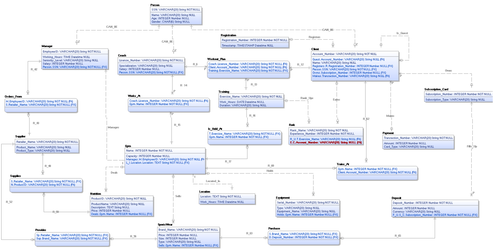

# "Chekhov" 

The goal of this project is to create a gym management system for all "gyms" of the company. The system will be able to manage the following:
1. Employees 
2. Coaches with their working hours
3. Clients 
4. Gyms
5. Equipments
6. Gym classes 
7. Training exercises
8. Workout plans for each client
9. Suppliers who provide equipment nutrition and sport wear
10. Payments
11. Purchases of clients 
12. Orders of each gym from suppliers

## Project structure
All models are located in `gym/models.py`, and all gym management functions are located in `gym/admin.py`.

## Database architecture


## How to run?
```cmd
python manage.py makemigrations  # creates SQL queries
python manage.py migrate  # runs / applies SQL queries into the database
python manage.py createsuperuser  # creates a superuser
python manage.py runserver  # runs the server

Now you can access the website via the following link: 
http://127.0.0.1:8000/admin/
```
